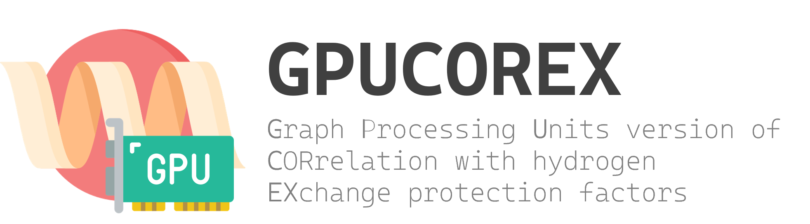

# gpuCOREX
**G**raph **P**rocessing **U**nits version of  
**COR**relation with hydrogen **EX**change protection factors  

**`UPDATED: 2025/03/12`**  

## Introduction
`COREX` _(**COR**relation with hydrogen **EX**change protection factors)_ is an algorithm designed to compute comformational stability of a protein. This program is slow due to it is single-processing program. Therefore, a muilti-processing program version COREX is developed named `pCOREX`. This improves COREX efficiency significantly. However, the speed is still limited. Therefore, we are going to develop a GPU version of COREX named `gpuCOREX` to accelerate it more.

## Cite  
Li, J., Landry, S. J., & Mettu, R. R. (2024, December). GPU Acceleration of Conformational Stability Computation for CD4+ T-cell Epitope Prediction. In 2024 IEEE International Conference on Bioinformatics and Biomedicine (BIBM) (pp. 191-196). IEEE.
```bibtex
@inproceedings{li2024gpu,
  title={GPU Acceleration of Conformational Stability Computation for CD4+ T-cell Epitope Prediction},
  author={Li, Jiarui and Landry, Samuel J and Mettu, Ramgopal R},
  booktitle={2024 IEEE International Conference on Bioinformatics and Biomedicine (BIBM)},
  pages={191--196},
  year={2024},
  organization={IEEE}
}
```

## Requirements
|Package|Version|Usage|Website|
|:------|:-----:|:----|:-----:|
|biopandas|`0.4.1`|PDB I/O|[](https://biopandas.github.io/biopandas/)|
|biotite |`0.38.0`|PDB I/O and SASA|[](https://www.biotite-python.org/)|
|freesasa|`2.2.0`|SASA|[](https://freesasa.github.io/python/)|
|matplotlib |`3.7.3`|Plot figures|[](https://matplotlib.org/)|
|numpy |`1.24.4`|Mathmatical computation|[](https://numpy.org/)|
|pandas |`2.0.3`|Data processing|[](https://pandas.pydata.org/)|
|scipy |`1.10.1`|Scientific compuation|[](https://scipy.org/)|
|scikit-learn |`1.10.1`|Scientific compuation|[](https://scikit-learn.org/stable/)|
|tqdm |`4.66.1`|Progress display|[](https://tqdm.github.io/docs/tqdm/)|
|pytorch |`lastest`|GPU computation|[](https://pytorch.org/)|

These packages can be installed with [ requirements.txt](./requirements.txt).   
```bash
pip install -r ./requirements.txt
```

## gpuCOREX Guideline
The documentation for protein I/O and gpuCOREX: [ README.md](./docs/document.md)

This is a brief example for how to use this gpuCOREX to compute COREX for one PDB file.

## Python API
1. Import data structure and COREX module.
```python
from gpucorex import Peptide
from gpucorex import COREX
```
2. Load peptide data
```python
peptide = Peptide(
    './3JWO.pdb',
    window_size=10,
    min_size=4,
    dSbb_len_correlation = -0.12,
    residue_constant='amino_acid_constants.csv',
    radius_table='atom_radius.csv')
```
3. Initialize COREX module with adaptive Monte Carlo sampling with probability threshold 75% and adaptive rate 5%. For more samplers, please check [ README.md: Sampler](./docs/code/README.md#sampler).
```python
corex = COREX(
    workers=10,
    batch_size=1000,
    samples=10000,
    device='cpu',
    dtype=torch.float32,
    sampler=sampler.adaptive_montecarlo, 
    sampler_args=dict(
        probability=0.75,
        adaptive_rate=0.05,
        min_rate=0.01
    ),
    base_fraction=1.0,
    silence=False,
    probe_radius=1.4,
    point_number=1000,
    sconf_weight = 0.5,
    temperature = 298.15,
    temp_zero = 273.15+60,
    aCp = 0.44,
    bCp = -0.26,
    adeltaH = -8.44,
    bdeltaH = 31.4,
    TsPolar = 335.15,
    TsApolar = 385.15,
    context_method='spawn'
)
```
4. Calculate COREX for the peptide.
```python
corex_values = corex(peptide)
```
5. Auto search a reasonable entropy weight (`sconf_weight`).
For details, please check [ README.md: Auto Entropy Factor Search](./docs/document.md#auto-entropy-factor-search).
```python
from gpucorex import MaxMinCriterion
corex = COREX(
    workers=10,
    batch_size=1000,
    samples=10000,
    device='cpu',
    dtype=torch.float32,
    sampler=sampler.adaptive_montecarlo, 
    sampler_args=dict(
        probability=0.75,
        adaptive_rate=0.05,
        min_rate=0.01
    ),
    base_fraction=1.0,
    silence=False,
    probe_radius=1.4,
    point_number=1000,
    sconf_weight=MaxMinCriterion(1.0, 0.1, (0.01, 2.0)),
    temperature=298.15,
    temp_zero=273.15+60,
    aCp = 0.44,
    bCp = -0.26,
    adeltaH = -8.44,
    bdeltaH = 31.4,
    TsPolar = 335.15,
    TsApolar = 385.15,
    context_method='spawn'
)
```
Set the sconf_weight to a `Criterion`, the algorithm will automatically search for an entropy factor (sconf_weight).
Then, this factor will be used to compute COREX.

## Commandline Interface
```bash
python -m gpucorex -p {PDBfile.pdb}
```
or
```bash
gpucorex -p {PDBfile.pdb}
```
for command help, please check
```bash
gpucorex --help
```